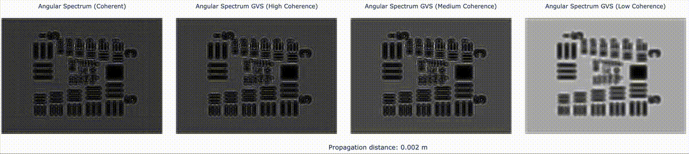

# The Generalized Van Cittert-Zernike Schell propagator



This is a simplified repository showcasing different functionalities of the
GVS propagator, which is an efficient algorithm for simulating partially
coherent light. The model uses the Van Cittert-Zernike theorem to find the
complex coherence factor from a light source reaching the object plane,
and it then uses the generalized Schell’s theorem to compute the diffraction
pattern produced at a given propagation distance, not limited to the far field.

The repository also contains an example of how to use the GVS propagator to
simulate a computer-generated holography using Pytorch.

<center>
<video width="320" height="320" controls>
  <source src="assets/cat_fish.mp4" type="video/mp4">
</video>
</center>

## 🗂️ Repository Structure

These are the files to take a look at 👀:

- `gvs_propagator/`
  - `coherent.py`: Different coherent propagation algorithms.
  - `partially_coherent.py`: Implementation of partially coherent propagation algorithms.
  - `cgh/`
    - `rgb_asm.py`: Application of GVS to computer-generated holography using Pytorch. 
  - `notebooks/`
    - `gvs_propagator.ipynb`: Main example notebook showcasing the proposed algorithms.
    - `cgh.ipynb`: Example notebook showing a CGH optimization using GVS and its results.


- 🚀 Take a look at the exported HTML version of the [GVS propagator notebook](https://mmonto952.github.io/gvs-propagator/).
- 🚀 Take a look at the exported HTML version of the [Partially coherent CGH notebook](https://mmonto952.github.io/partially-coherent-cgh/).

## 📦 Required Packages

This project uses [Poetry](https://python-poetry.org/) for dependency management. The main dependencies are:

- Python 3.11+
- numpy
- scipy
- dask
- pandas
- plotly
- imageio
- kaleido (for static image export with plotly)
- pytorch

## 📖 Citation

Bibtex entry for [GVS](https://opg.optica.org/oe/fulltext.cfm?uri=oe-33-22-46313):

```text
@article{Montoya2025GeneralizedLight,
    title = {{Generalized Van Cittert-Zernike Schell propagator: an efficient algorithm for simulating partially coherent light}},
    year = {2025},
    journal = {Optics Express},
    author = {Montoya, Manuel and Lopera, Maria J. and Nie, Yunfeng and Blinder, David},
    number = {22},
    month = {11},
    pages = {46313--46325},
    volume = {33},
    publisher = {Optica Publishing Group},
    doi = {10.1364/OE.571673},
    issn = {1094-4087},
}
```

The citation for the Partially coherent CGH work will be available once the article has been published.